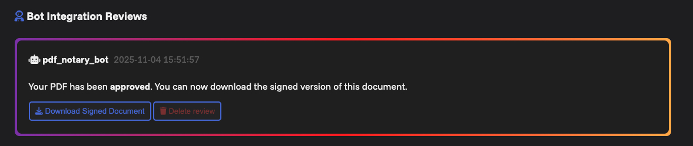

# 
📄➕ Round Review Plugins

<a href="https://github.com/Maxelweb/RoundReview">Round Review</a> is a PDF platform to manage documents and reviews with collaborators. 
This is a mono-repository that contains <strong>plugins</strong> for the platform working via REST API and WEBHOOKS.

## PDF Notary Bot

The PDF Notary Bot is a Round Review plugin to sign PDF with a custom certificate whenever a document gets approved. This will generated a signed version of the PDF that can be downloaded from the document review page of the application.

- See [Docs and first installation](docs/pdf-notary-bot.md)

## Example Bot

The example bot plugin is a boilerplate to get started with Round Review integration.

- See [Docs and first installation](docs/example-bot.md)

## AI Reviewer Bot

The AI Reviewer Bot extracts text from PDFs when they enter `Pending Review`, sends it to an Ollama or OpenAI-compatible API, and publishes the model response as an integration review. It includes a password-protected dashboard for LLM status and system prompt configuration.

- See [Docs and first installation](docs/ai-reviewer-bot.md)

Quick start:

1. `cp envs/template.ai-reviewer-bot.env envs/ai-reviewer-bot.env`
2. Configure `API_KEY`, `LLM_BASE_URL`, `LLM_MODEL`, and `DASHBOARD_PASSWORD`.
3. `docker compose up roundreview_ai_reviewer_bot -d --build`
4. Set the RoundReview webhook URL to `http://<bot-host>:8083/webhook`.

# Docker stack management

1. `docker-compose up -d`: Start all containers in the stack
1. `docker-compose down`: Stop all containers in the stack

> [!TIP]
> Copy `docker-compose.yml` and paste as `docker-compose.custom.yml`. Then customize the stack according to your needs.

1. `docker-compose -f docker-compose.custom.yml up -d`
1. `docker-compose -f docker-compose.custom.yml down`

## Updates

1. `git pull` the last updates from the repository
1. `docker-compose up -d --build`: Start and build all containers; this will automatically update the internal database

# License and Credits

[Apache 2.0 License](./LICENSE)

Developed by [Maxelweb](https://github.com/Maxelweb) for anyone!