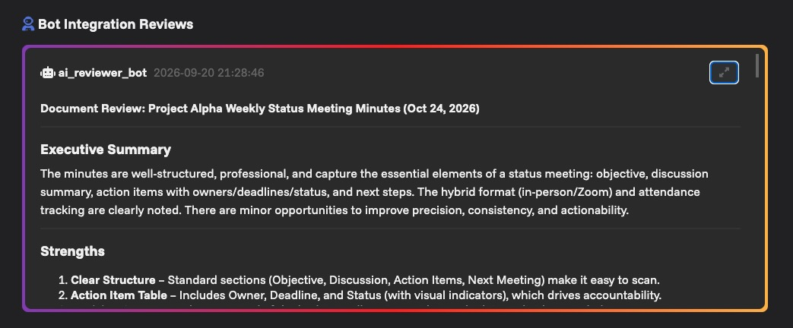

# AI Reviewer Bot

The AI Reviewer Bot is a RoundReview plugin that reviews PDF documents with an Ollama or OpenAI-compatible LLM.

When a document changes from `No Review` to `Pending Review`, the bot creates an integration review, extracts the PDF text with `pypdf`, sends the text to the configured LLM, and updates the same integration review with the model response as-is.



## First installation

1. Create the environment file:
	- `cp envs/template.ai-reviewer-bot.env envs/ai-reviewer-bot.env`
2. Set at least `API_KEY`, `LLM_BASE_URL`, `LLM_MODEL`, and `DASHBOARD_PASSWORD` in `envs/ai-reviewer-bot.env`.
3. Make sure the configured RoundReview user has a webhook URL available and can create integration reviews.
4. Start the container:
	- `docker compose up roundreview_ai_reviewer_bot -d --build`
	- To stop it: `docker compose down roundreview_ai_reviewer_bot`
5. Configure the RoundReview webhook URL as `http://<bot-host>:8083/webhook`.
6. Open `http://<bot-host>:8083/dashboard` and sign in with `DASHBOARD_PASSWORD`.

The service is also available as `http://<bot-host>:8083/`, which returns the bot and LLM connection status.

## Web routes

- `/`: bot status and LLM connectivity check
- `/webhook`: receives RoundReview `object.updated` notifications
- `/dashboard`: password-protected LLM status and system prompt configuration


## Environment variables

The template file is the main reference for local configuration. The sections below group the variables by purpose, and they include the supported runtime variable that is not present in the template file.

### RoundReview API settings

| Variable name | Description | Template/default value | Required to change |
|---|---|---|---|
| `API_KEY` | API key of the RoundReview user used by the plugin | Empty | Yes |
| `API_BASE_URL` | RoundReview API endpoint | `http://host.docker.internal:8080/api` | Only for custom deployments |
| `PLUGIN_BASE_URL` | Public URL of the plugin | `http://localhost:8083` | Yes, when externally reachable |
| `PLUGIN_BASE_URL_PREFIX` | Optional URL prefix behind a reverse proxy | Empty | No |

### LLM settings

| Variable name | Description | Template/default value | Required to change |
|---|---|---|---|
| `LLM_BASE_URL` | LLM server base URL | Empty in template; set to an Ollama/OpenAI-compatible endpoint such as `http://host.docker.internal:11434` | Yes |
| `LLM_API_KEY` | Optional bearer token for authenticated compatible APIs | Empty | Only for authenticated APIs |
| `LLM_API_TYPE` | LLM API mode: `auto`, `ollama`, or `openai` | `auto` | No |
| `LLM_MODEL` | Model name sent to the LLM | `nemotron-3-ultra` | Yes |
| `LLM_TIMEOUT_SECONDS` | Maximum LLM request duration in seconds | `600` | No |

### Dashboard and prompt settings

| Variable name | Description | Template/default value | Required to change |
|---|---|---|---|
| `DASHBOARD_ENABLED` | Enables password protection for `/dashboard` | `True` | Yes |
| `DASHBOARD_PASSWORD` | Password protecting `/dashboard` | Empty | Yes |
| `DASHBOARD_SECRET_KEY` | Flask session signing key; falls back to `DASHBOARD_PASSWORD` when empty | `change-this-key` | Recommended |
| `SYSTEM_PROMPT` | Initial system prompt used before a saved prompt file exists | Built-in review prompt | No |
| `SYSTEM_PROMPT_FILE` | Saved system prompt persistence path | `/data/system_prompt.txt` | No |

### Debug and development settings

| Variable name | Description | Template/default value | Required to change |
|---|---|---|---|
| `DEBUG` | Enable Flask debug mode and verbose logging | Empty | No |

## Bot flow

1. A reviewer or project owner changes a document status to `Pending Review`.
2. RoundReview sends an `object.updated` webhook to `/webhook`.
3. The bot creates this initial integration review message:
	- `Bot is starting reviewing the document. Updates will be published here`
4. The bot loads the PDF from the RoundReview API and extracts its text.
5. The text is sent to the configured LLM together with the system prompt.
6. The integration review is updated with the complete LLM response, without rewriting or formatting it.

The webhook returns immediately with HTTP `202`; PDF extraction and LLM processing run in a background Python thread. Repeated notifications for the same document are ignored while a review is running.

## Extras

### Webhook payload

This is the expected webhook payload:

```json
{
  "event": "object.updated",
  "object_id": "98eb135f-c083-435a-9929-e6f9ad3810fd",
  "project_id": "project-id",
  "updated_fields": {
	 "status": "Pending Review"
  },
  "updated_at": "2025-10-12T17:50:16.917017Z"
}
```

Notifications for other events or statuses are acknowledged and ignored.

### LLM configuration

The plugin supports two chat API formats:

- `LLM_API_TYPE=ollama`: health check at `/api/tags`, chat request at `/api/chat`.
- `LLM_API_TYPE=openai`: health check at `/models`, chat request at `/chat/completions`.
- `LLM_API_TYPE=auto`: uses Ollama when `LLM_BASE_URL` ends with `:11434` or contains `ollama.com`, otherwise uses the OpenAI-compatible format.

For Ollama, make sure the configured model has already been pulled, for example `ollama pull nemotron-3-super`. For an authenticated compatible API, set `LLM_API_KEY`.

### Dashboard and system prompt

The dashboard requires `DASHBOARD_PASSWORD`. After login, it displays the system prompt editor only when the LLM health check succeeds. The prompt is saved to `/data/system_prompt.txt`, which is persisted by the `rr_ai_reviewer_data` Docker volume. When a prompt has been saved from the dashboard, it has priority over `SYSTEM_PROMPT` from the environment and remains active after container restarts.

Set `DASHBOARD_SECRET_KEY` to a long random value in production. If it is empty, the application falls back to `DASHBOARD_PASSWORD` for Flask session signing.

## Security notes

- Keep `API_KEY`, `LLM_API_KEY`, and dashboard credentials out of version control.
- Expose `/dashboard` only over HTTPS when the plugin is reachable outside a private network.
- Use a dedicated RoundReview API key for the bot and rotate it if the plugin endpoint is exposed.